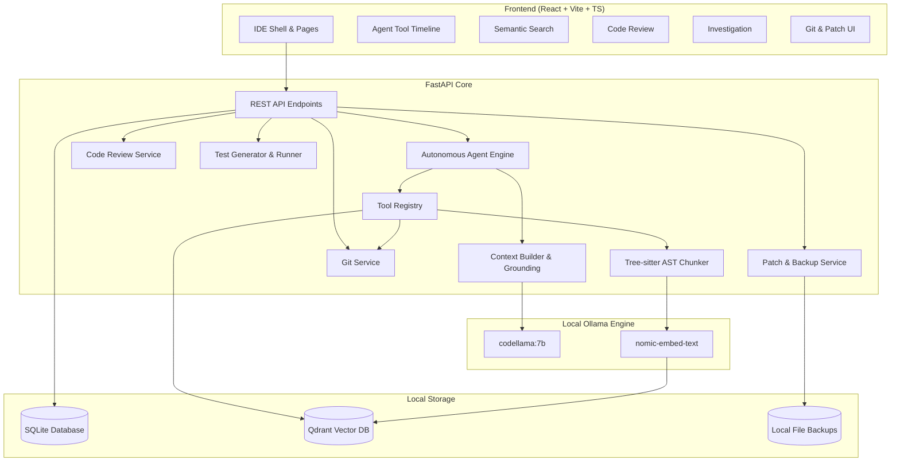

# AI Code Intelligence & Review Agent

> **A production-quality, repository-aware AI coding assistant that runs 100% locally and privately.**  
> **TOTAL COST = $0.00** — No OpenAI, no Anthropic, no Gemini, no Pinecone, no cloud billing, no API keys.

---

## Highlights

- **Repository-Aware Semantic Search**: AST-aware chunking via Tree-sitter + local vector embeddings via Ollama (`nomic-embed-text`) stored in Qdrant.
- **Autonomous Multi-Step Agent**: Reasoning loop capable of inspecting file trees, reading code, searching symbols, running grep, and inspecting git history.
- **Automated Code Review**: Scans code or diffs for critical security flaws (SQL injection, hardcoded secrets, unsafe `eval`), logic bugs, and algorithmic complexity.
- **Issue Investigation & Root-Cause Analysis**: Multi-turn autonomous diagnosis that explores relevant files, pinpoints root causes, and recommends concrete fixes.
- **Framework-Aware Test Generator**: Inspects source files and existing test conventions to automatically produce idiomatic unit and integration tests (PyTest, Vitest, Jest, Go, Cargo).
- **Safe Test Runner**: Subprocess sandboxing with timeout controls and strict allowlist enforcement to prevent arbitrary command execution.
- **Git & Patch Integration**: Git status, diff viewer, commit history, and unified diff patch generator with automated pre-modification backups.
- **Developer-Centric Dark Theme IDE**: Modern React 18 + Vite + Tailwind interface styled after VS Code and JetBrains IDEs with collapsible tool execution timelines.

---

## Zero-Cost Guarantee

| Component | Technology | Cost | Cloud Dependency |
|---|---|---|---|
| **LLM Runtime** | Ollama (`codellama:7b` / `llama3.1`) | **$0.00** | None (100% Local) |
| **Embeddings** | Ollama (`nomic-embed-text`) | **$0.00** | None (100% Local) |
| **Vector DB** | Qdrant (Docker / Local Embedded) | **$0.00** | None (Open Source) |
| **Relational DB** | SQLite + SQLAlchemy (aiosqlite) | **$0.00** | None (Local File) |
| **Code Parsing** | Tree-sitter Grammars (AST) | **$0.00** | None (Open Source) |
| **Backend API** | FastAPI + Uvicorn + Pydantic v2 | **$0.00** | None (Open Source) |
| **Frontend UI** | React + Vite + TypeScript + Tailwind | **$0.00** | None (Local Client) |
| **Containerization** | Docker Compose | **$0.00** | None (Local Engine) |

See [docs/COST_AUDIT.md](docs/COST_AUDIT.md) for the exhaustive dependency-level cost audit.

---

## Quick Start

### 1. Prerequisites
- **Python**: 3.10+ (tested through 3.14)
- **Node.js**: 18+ (tested with v22)
- **Git**
- **Ollama**: [ollama.com](https://ollama.com) (free local LLM engine)
- **Docker Desktop** (optional for Qdrant server; embedded fallback available)

### 2. Pull Recommended Local Models (Free)
```bash
# Start Ollama engine
ollama serve

# Pull default code model and embedding model
ollama pull codellama:7b
ollama pull nomic-embed-text
```

### 3. Clone and Setup Backend
```bash
cd backend

# Create virtual environment
python3 -m venv venv
source venv/bin/activate

# Install dependencies
pip install -r requirements.txt

# Run backend API server
python -m uvicorn app.main:app --host 0.0.0.0 --port 8000 --reload
```
API Documentation and Swagger UI will be live at: `http://localhost:8000/docs`

### 4. Setup Frontend
```bash
cd frontend

# Install dependencies
npm install

# Start Vite development server
npm run dev
```
Open your browser at: `http://localhost:5173`

---

## Docker Compose Deployment

To run the complete containerized stack (FastAPI Backend + Nginx Frontend + Qdrant Vector DB):

```bash
docker compose up --build
```
- **Frontend App**: `http://localhost:3000`
- **Backend API**: `http://localhost:8000`
- **Qdrant Dashboard**: `http://localhost:6333/dashboard`

---

## Architecture



---

## Running the Automated Test Suite

```bash
cd backend
source venv/bin/activate
pytest tests/ -v
```

All 16 unit and integration test suites will execute:
- Tree-sitter AST and line fallback chunking
- Path traversal and security containment
- Command injection allowlist verification
- Autonomous agent tool execution
- End-to-end FastAPI lifecycle endpoints

---

## Documentation

- [Cost Audit Report ($0 Verified)](docs/COST_AUDIT.md)
- [Security Model & Safeguards](docs/SECURITY.md)
- [System Architecture & Design Decisions](docs/ARCHITECTURE.md)

---

## License

MIT License — 100% Free and Open Source.
