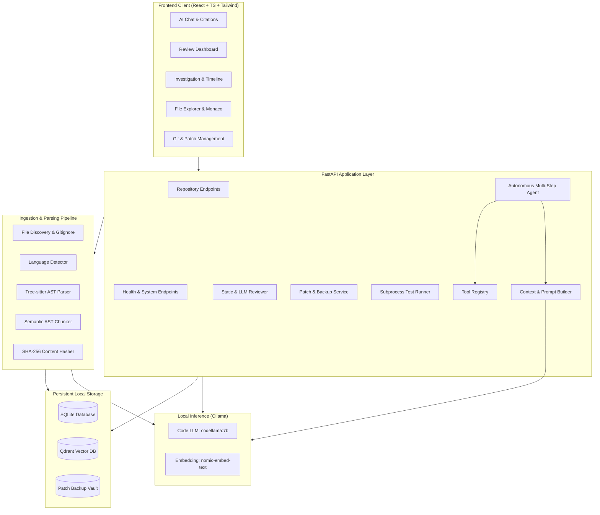
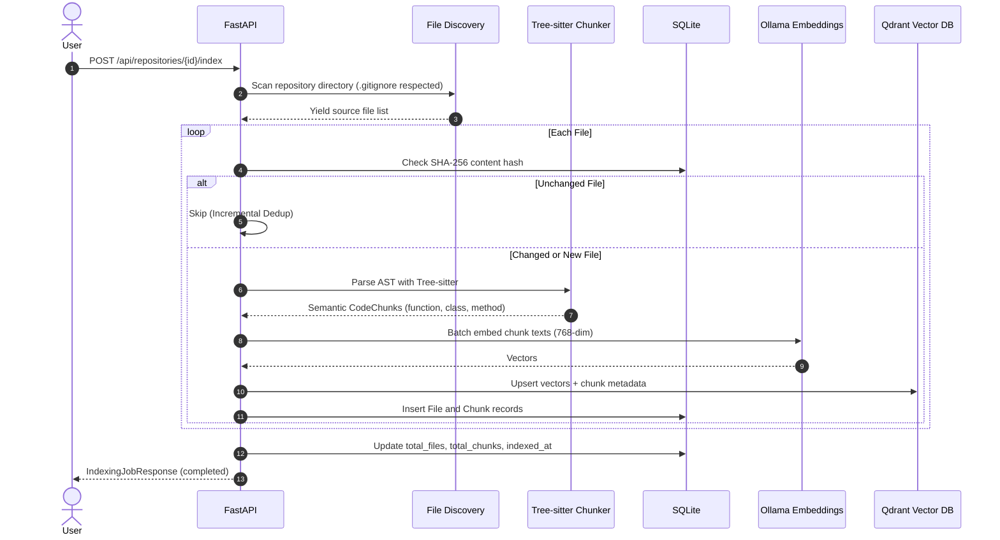
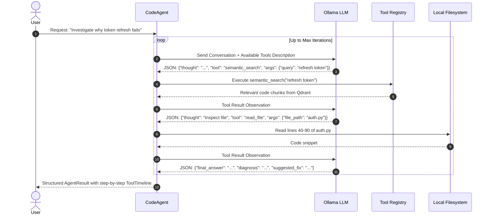

# System Architecture & Technical Specifications

**Project**: AI Code Intelligence & Review Agent  
**Version**: 1.0.0  
**Stack**: FastAPI, React 18, Vite, TypeScript, Tailwind, Ollama, Qdrant, Tree-sitter, SQLite

---

## 1. System Overview

The AI Code Intelligence & Review Agent is designed as a modular, local-first system consisting of three primary tiers:
1. **Frontend IDE Experience**: A React single-page application providing code exploration, conversational AI, code review dashboards, automated test triggers, and git workflows.
2. **Backend Engine**: A high-performance asynchronous FastAPI service managing AST parsing, vector embeddings, autonomous agent execution, and security controls.
3. **Local Storage & Inference Engines**: Ollama for local model inference, Qdrant for dense vector similarity search, and SQLite for relational state and chat histories.

---

## 2. Component Architecture

---

## 3. Detailed Data Flows

### Ingestion & Indexing Pipeline

---

### Autonomous Agent Reasoning Loop

---

## 4. Database Schema (SQLite)

- **`repositories`**: Registered projects, path, default branch, language breakdown, file/chunk counts, indexing timestamps.
- **`files`**: Discovered source files, repo-relative path, language, byte size, SHA-256 content hash.
- **`chunks`**: AST semantic code chunks, symbol name, symbol type, start line, end line, content hash, code content.
- **`indexing_jobs`**: Job status, files processed, chunks embedded, skipped chunks, execution durations, errors.
- **`chat_sessions`**: Multi-turn conversation sessions tied to a specific repository.
- **`messages`**: Individual user/assistant messages with JSON serialized citations and tool calls.
- **`reviews`**: Code review results with structured severity findings.
- **`investigations`**: Multi-step issue investigations with root cause diagnoses and tool execution traces.
- **`generated_patches`**: Unified diff proposals, target files, and application statuses.
- **`test_runs`**: Executed test suite outputs, command lines, exit codes, and durations.

---

## 5. Extensibility & Future Integrations

- **Custom Local Models**: Seamlessly configurable in `.env` or UI settings (`deepseek-coder:6.7b`, `qwen2.5-coder:7b`, `llama3.1:8b`).
- **Additional Grammars**: Easily register new Tree-sitter grammar packages in `backend/app/indexing/chunker.py`.
- **Custom Agent Tools**: Add new `@tool_registry.register` decorators to extend the agent's toolbelt with linters, formatters, or profiling tools.
